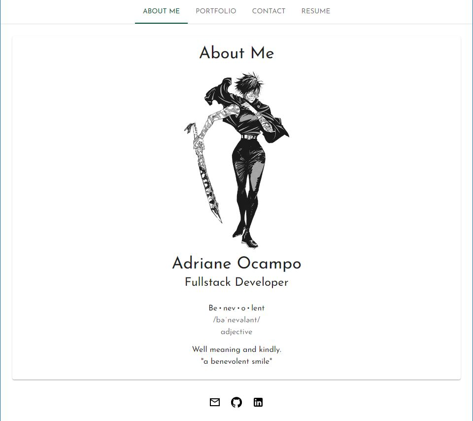

# Project Name - Portfolio
​
## Table of contents
​
- [Overview](#overview)
  - [The challenge](#the-challenge)
  - [User Story](#user-story)
  - [Acceptance Criteria](#acceptance-criteria)
  - [Screenshot](#screenshot)
  - [Links](#links)
- [My process](#my-process)
  - [Built with](#built-with)
  - [What I learned](#what-i-learned)
  - [Continued development](#continued-development)
  - [Useful resources](#useful-resources)
- [Author](#author)
​
## Overview
​
### The challenge
​
Create and update portfolio using the latest technology: React. 
​
### User Story
​
```
AS AN employer looking for candidates with experience building single-page applications
I WANT to view a potential employee's deployed React portfolio of work samples
SO THAT I can assess whether they're a good candidate for an open position
```
​
### Acceptance Criteria
​
```
GIVEN a single-page application portfolio for a web developer
WHEN I load the portfolio
THEN I am presented with a page containing a header, a section for content, and a footer
WHEN I view the header
THEN I am presented with the developer's name and navigation with titles corresponding to different sections of the portfolio
WHEN I view the navigation titles
THEN I am presented with the titles About Me, Portfolio, Contact, and Resume, and the title corresponding to the current section is highlighted
WHEN I click on a navigation title
THEN I am presented with the corresponding section below the navigation without the page reloading and that title is highlighted
WHEN I load the portfolio the first time
THEN the About Me title and section are selected by default
WHEN I am presented with the About Me section
THEN I see a recent photo or avatar of the developer and a short bio about them
WHEN I am presented with the Portfolio section
THEN I see titled images of six of the developer’s applications with links to both the deployed applications and the corresponding GitHub repository
WHEN I am presented with the Contact section
THEN I see a contact form with fields for a name, an email address, and a message
WHEN I move my cursor out of one of the form fields without entering text
THEN I receive a notification that this field is required
WHEN I enter text into the email address field
THEN I receive a notification if I have entered an invalid email address
WHEN I am presented with the Resume section
THEN I see a link to a downloadable resume and a list of the developer’s proficiencies
WHEN I view the footer
THEN I am presented with text or icon links to the developer’s GitHub and LinkedIn profiles, and their profile on a third platform (Stack Overflow, Twitter) 
```
​
### Screenshot
​

​​
### Links
​
Portfolio Github Page: [Profile Portfolio](https://ocampoad.github.io/react-profile/)

​
## My process
​
### Built with
- React JS
- Materials UI
​

### What I learned
​
This challenge introduced me to using React. I was able to create a portfolio using React and Materials UI. The creation process was intuitive and even easy to implement. 
​
### Continued development
​
As a relatively new technology, React makes creating applications easy and intuitive. I enjoyed learning using React and Materials UI. I have only scratched the surface of React and there is so much more to learn. There are also several components in Materials UI I yet have to use. 
​
### Useful resources
​
- [React JS](https://reactjs.org/) - TDocumentation for React was helpful in navigating through the rendered pages
- [Materials UI](https://mui.com/material-ui/getting-started/overview/) - I was able to manipulate the given examples to fit my needs
​- [Stackoverflow](https://stackoverflow.com/) - Stackoverflow helped answered several React specific questions
- [W3School](https://www.w3schools.com/css/default.asp) - A refresher with CSS and learning how to use styles in React

## Author
​
- Adriane Ocampo- [Adriane Ocampo](https://github.com/ocampoad)

​